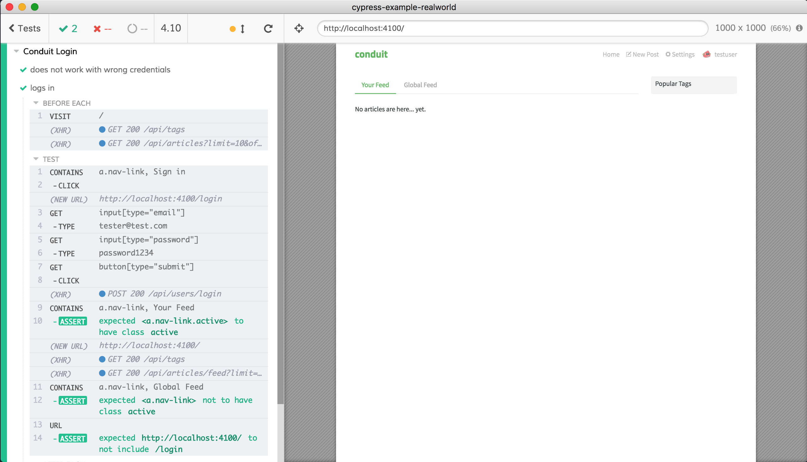
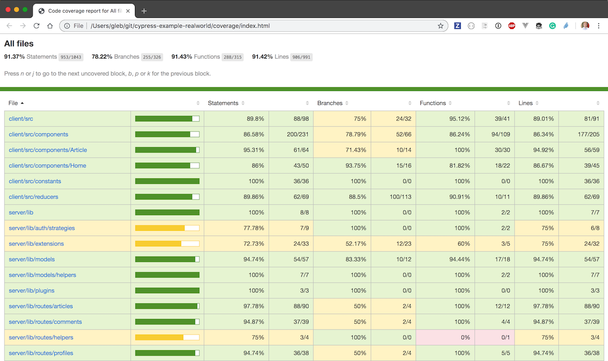

# realworld [![renovate-app badge][renovate-badge]][renovate-app]   

Fork of [applitools/cypress-applitools-webinar](https://github.com/applitools/cypress-applitools-webinar) which is a fork of [gothinkster/realworld](https://github.com/gothinkster/realworld) "Conduit" blogging application.

## Tests

The tests are in [cypress/integration](cypress/integration) folder

## Full code coverage

Front- and back-end coverage for this application is collected using the [@cypress/code-coverage](https://github.com/cypress-io/code-coverage) plugin. You can run the locally instrumented server and client using `npm run dev:coverage` command. The backend coverage is exposed in [server/server/index.js](server/server/index.js) via endpoint listed in [cypress.json](cypress.json) (usually `GET /__coverage`). The frontend coverage is collected by instrumenting the web application source code on the fly, see the [client/.babelrc](client/.babelrc) file.

The combined report is saved in `coverage/index.html` after the tests finish:

To learn more, read the [Cypress code coverage guide](https://on.cypress.io/coverage).

[renovate-badge]: https://img.shields.io/badge/renovate-app-blue.svg
[renovate-app]: https://renovateapp.com/

Requires Python 2.7 for node-gyp to be compiled.
